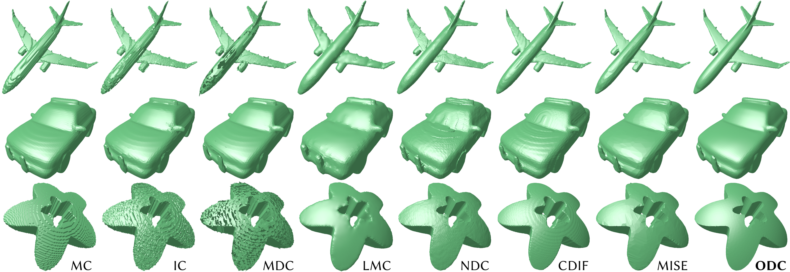
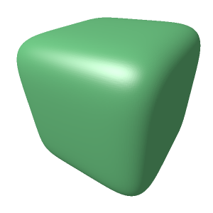

# Occupancy-Based Dual Contouring, SIGGRAPH Asia 2024
[![CC BY-NC-SA 4.0][cc-by-nc-sa-shield]][cc-by-nc-sa]



Jisung Hwang and [Minhyuk Sung](https://mhsung.github.io/) <br>

This repository contains the official implementation of [**Occupancy-Based Dual Contouring**](https://arxiv.org/abs/2409.13418). [[**Project Page**](https://occupancy-based-dual-contouring.github.io/)] <br>
**Occupancy-Based Dual Contouring** is a dual contouring method that is designed for _neural implicit functions_ defined in _continuous 3D space_ such as [IM-NET](https://github.com/czq142857/IM-NET), [Occupancy Networks](https://github.com/autonomousvision/occupancy_networks), or [DeepSDF](https://github.com/facebookresearch/DeepSDF).

### Abstract
> *We introduce a dual contouring method that provides state-of-the-art performance for occupancy functions while achieving computation times of a few seconds. Our method is learning-free and carefully designed to maximize the use of GPU parallelization. The recent surge of implicit neural representations has led to significant attention to occupancy fields, resulting in a wide range of 3D reconstruction and generation methods based on them. However, the outputs of such methods have been underestimated due to the bottleneck in converting the resulting occupancy function to a mesh. Marching Cubes tends to produce staircase-like artifacts, and most subsequent works focusing on exploiting signed distance functions as input also yield suboptimal results for occupancy functions. Based on Manifold Dual Contouring (MDC), we propose Occupancy-Based Dual Contouring (ODC), which mainly modifies the computation of grid edge points (1D points) and grid cell points (3D points) to not use any distance information. We introduce auxiliary 2D points that are used to compute local surface normals along with the 1D points, helping identify 3D points via the quadric error function. To search the 1D, 2D, and 3D points, we develop fast algorithms that are parallelizable across all grid edges, faces, and cells. Our experiments with several 3D neural generative models and a 3D mesh dataset demonstrate that our method achieves the best fidelity compared to prior works.*

# How to use

The only requirement for *occupancy_dual_contouring* is PyTorch. (Although we used version 1.13.0, it may also work with other versions, as it primarily uses fundamental functions.)

Copy _occupancy_dual_contouring.py_ into your directory, and run as follows:

```python
import torch
def implicit_function(xyz):
    # xyz: torch.Tensor (N, 3) torch.float64
    # return: torch.Tensor (N,) torch.float64
    # example
    return torch.norm(xyz ** 3, dim = 1) - 0.1;

from occupancy_dual_contouring import occupancy_dual_contouring
odc = occupancy_dual_contouring("cuda:1");
# vertices: torch.Tensor (N, 3) torch.float64
# triangles: torch.Tensor (N, 3) torch.int64
vertices, triangles = odc.extract_mesh(implicit_function);
```



### Optional Parameters of _odc.extract_mesh_

| **Parameter** | **Default Value** | **Description** |
|---|---|---|
| `min_coord` | `[-0.5, -0.5, -0.5]` | Minimum coordinates of the 3D bounding box $\mathcal{P}$. |
| `max_coord` | `[0.5, 0.5, 0.5]` | Maximum coordinates of the 3D bounding box $\mathcal{P}$. |
| `num_grid` | `128` | Resolution (number of grid cells) for each axis. |
| `isolevel` | `0.0` | Iso-level to extract. `0.5` for the occupancy function, `0.0` for SDF. |
| `batch_size` | `100000000`| GPU Capacity. (GPU VRAM $\uparrow$, `batch_size` $\uparrow$) |
| `imp_func_cplx` | `3` | GPU VRAM usage of the implicit function for querying one point. |
| `outside`  | `True` | If a larger value indicates outside, `True`; otherwise, `False`. |
| `BINARY_SEARCH` | `15` | Number of iterations for 1D point search. |
| `VERTICAL_RANGE` | `0.8` | Range for step (1) of the 2D point search. |
| `VERTICAL_LINEAR_SEARCH` | `4` | Number of linear iterations for step (1) of the 2D point search. |
| `VERTICAL_BINARY_SEARCH` | `11` | Number of binary iterations for step (1) of the 2D point search. |
| `HORIZNTL_RANGE`  | `0.71` | Range for step (2) of the 2D point search. |
| `HORIZNTL_LINEAR_SEARCH` | `3` | Number of linear iterations for step (2) of the 2D point search. |
| `HORIZNTL_BINARY_SEARCH` | `12` | Number of binary iterations for step (2) of the 2D point search. |
| `ERR` | `3e-7` | Error level tolerance. |
| `SEP` | `1e-3` | Minimum separation of a 3D point from the grid face. |
| `QEF_REG` | `0.05` | Regularization coefficient for QEF. |  
| | | |

# Demo

We provide the demo code of mesh_extraction from neural occupancy functions at `demo/demo.ipynb`.

# BibTeX
```bibtex
@inproceedings{hwang2024odc,
    title = {Occupancy-Based Dual Contouring},
    author = {Hwang, Jisung and Sung, Minhyuk},
    booktitle = {SIGGRAPH Asia 2024 Conference Papers},
    year = {2024}
}
```

This work is licensed under a
[Creative Commons Attribution-NonCommercial-ShareAlike 4.0 International License][cc-by-nc-sa].

[![CC BY-NC-SA 4.0][cc-by-nc-sa-image]][cc-by-nc-sa]

[cc-by-nc-sa]: http://creativecommons.org/licenses/by-nc-sa/4.0/
[cc-by-nc-sa-image]: https://licensebuttons.net/l/by-nc-sa/4.0/88x31.png
[cc-by-nc-sa-shield]: https://img.shields.io/badge/License-CC%20BY--NC--SA%204.0-lightgrey.svg
